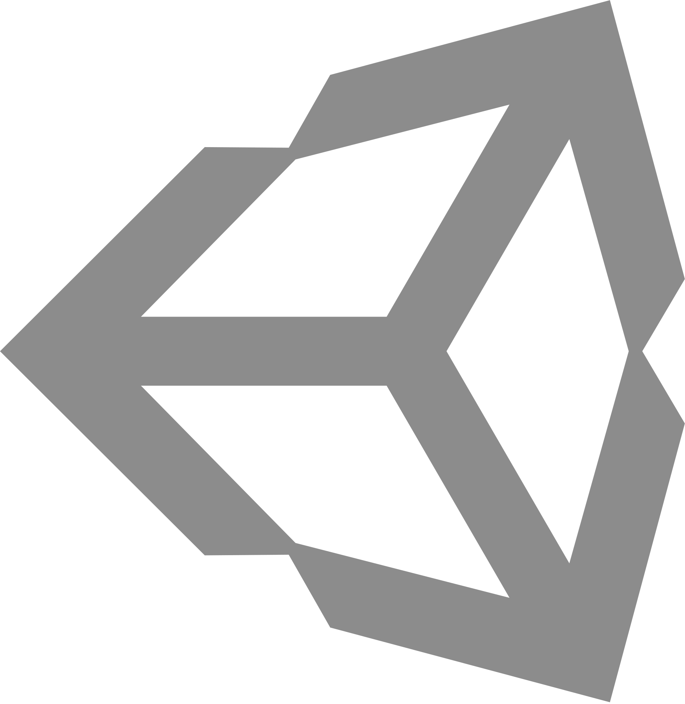

<!--
|#|========================================|#|
|#|Welcome to source of ByteCorum's Readme |#|
|#|I don't know what are you rly trying to |#|
|#|find here but anyway have fun           |#|
|#|========================================|#|
-->

<h1>ByteCorum</h1>

 If you're seeing this, you've come across ByteCorum's GitHub profile. So let's just assume you've done intentionally, because you want to learn about this individual.

---

<h3>Introduction</h3>

I'm a developer with a strong interest in systems, automation, and security. I've spent years working with Python, C++, and C, and I'm currently exploring Rust. I also build deployment pipelines, manage Linux systems, and experiment with ways to make technology more private, secure, and reliable.

---

<h3>The ByteCorums's Journey</h3>

<!--ByteCorum's heart beats for development. It's the largest slice of his professional pie, at least now. Though who knows what the future holds?-->

<ul>
<li><b>Development:</b> 6+ years with , 5+ with , and 3+ with ; currently exploring .</li>

<li><b>Tools:</b> Experienced with , , , , , , , and relational databases including ,  and .</li>

<li><b>Infrastructure:</b> Runs and maintains a production-grade Debian server with custom tooling, automated deployments, <b> and  Actions, runners, and CI/CD pipelines</b>.</li>

<li><b>Systems:</b> Comfortable with <b>kernel and sysctl tuning, , UFW, NFTables, , , backups</b>, and troubleshooting everything from broken builds to stubborn production issues.</li>

<li><b>Security:</b> Enthusiastic about hardening servers and desktops, researching privacy, and exploring the development of a hardened, privacy-focused Linux distribution</li>
</ul>

---

<h3>Conclusion</h3>

Thank you for reading this, have a nice day!

If you are using an open-source project and you enjoy it, please consider donating at least $1. <b>If everyone donated to open-source(I mean open-source in general, any project) at least $1 per month, it would dramatically improve open-source making the digital world a much better place! You can't rely on proprietary solutions as they are basically a black box which may stop support every second, so in current digital world open-source is the only way to live!</b>

---

<h3>Additional Info</h3>

 GitHub: <code>https://github.com/ByteCorum</code>

GitHub public GPG key

<pre>
-----BEGIN PGP PUBLIC KEY BLOCK-----

mDMEap64xhYJKwYBBAHaRw8BAQdAFN+5o09Hh+P50DL7IWE7nJVhSSyYSO8nR4lA
zDrgu8S0QUJ5dGVDb3J1bSAoR2l0aHViKSA8MTY0ODc0ODg3K0J5dGVDb3J1bUB1
c2Vycy5ub3JlcGx5LmdpdGh1Yi5jb20+iJYEExYKAD4WIQRlREuFPrWYDG5b7Yl2
afBcMRt9rQUCap64xgIbAwUJAeEzgAULCQgHAgYVCgkICwIEFgIDAQIeAQIXgAAK
CRB2afBcMRt9rdX8AQCR4H314An/rEP2PKYFRhYYvnNJUNjHoJpL4oFc/SM7gAD9
EYbs7WLH5GPOZz7D/+4AqxST2e41LhFbrAwf9Ccswwm4OARqnrjGEgorBgEEAZdV
AQUBAQdAGxSmi1jZwwPbCkWfxmHSC7o5Kt+iAt+MQjgmjtlNQFUDAQgHiH4EGBYK
ACYWIQRlREuFPrWYDG5b7Yl2afBcMRt9rQUCap64xgIbDAUJAeEzgAAKCRB2afBc
MRt9raaPAPwJZj2VjWrTitgH4umCaWq5tPA0kDKZCIFQA4nyyhrAJgD/XRFJgIJh
AFZp4UHg1oOuHfz7oJuFjAlY5/udpFpjqw4=
=vFJj
-----END PGP PUBLIC KEY BLOCK-----

</pre>

 

 GitLab: <code>https://gitlab.com/ByteCorum</code>

GitLab public GPG key

<pre>
-----BEGIN PGP PUBLIC KEY BLOCK-----

mDMEap663RYJKwYBBAHaRw8BAQdAuv+q4woFblZaE253f5Q7KiyX9bLfm4At/+QS
+czg6qq0QEJ5dGVDb3J1bSAoR2l0bGFiKSA8MzI1MzQ1NjMtQnl0ZUNvcnVtQHVz
ZXJzLm5vcmVwbHkuZ2l0bGFiLmNvbT6IlgQTFgoAPhYhBGh7S94PIInn7BG4oSKr
yL84D/NfBQJqnrrdAhsDBQkB4TOABQsJCAcCBhUKCQgLAgQWAgMBAh4BAheAAAoJ
ECKryL84D/Nf++UBAMq5sHHap4vxjAha8KmUoLqvh+vwqHfHwZKBlXl5HDKMAP0Y
2Z4U/7kF7JQzS47lYvhbfii40fawjv+MJqLyNkhpDLg4BGqeut0SCisGAQQBl1UB
BQEBB0C6CJKxSPIVd3yN58p9UJbHkV7/AgOLW3s8chN1RGaddAMBCAeIfgQYFgoA
JhYhBGh7S94PIInn7BG4oSKryL84D/NfBQJqnrrdAhsMBQkB4TOAAAoJECKryL84
D/NffI8A/3bJ0RzQ0EROJ7iwInOpNXmS6eRxF61/aNyro8DciOPyAQDRqkws3hXM
xTmf7ZjSuadZzauhkG+DTcNCnPVJ+QESAA==
=A0oO
-----END PGP PUBLIC KEY BLOCK-----

</pre>

---

<h3>Contact</h3>

 SimpleX: <code>https://smp11.simplex.im/a#2K6caIvN6vHcobLgCcgkbRAliN1Jv7Ud1UQ-jueqhZ8</code> 
 Sessions: <code>05aadca13873c6341646e375f3575a5ed4c73aecd6a398b5c2052629a5f69b771c </code>

---

<h3>Support</h3>

 Liberapay: <code>todo</code> 
 Bitcoin: <code>todo</code> 
 Monero: <code>todo</code>

---

_ByteCorum was here. Bite my binary raw code!_
